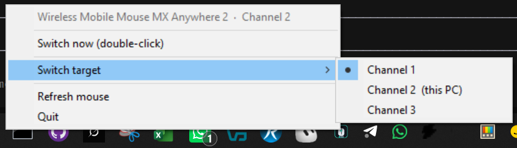

# MX Host Switch

Windows tray app that switches a Logitech mouse to another Easy-Switch / multi-host channel using HID++ **CHANGE HOST** (`0x1814`).

Double-click the tray icon to jump to a preselected channel. Right-click to pick that target (the tick marks the default).

## Download (no compile)

Get the ready-made Windows program from **[Releases](https://github.com/antonio-castellon/mx-host-switch/releases/latest)**:

1. Download `MXHostSwitch.exe`
2. Double-click it (no installer)
3. Look for the icon in the notification area (Windows 11 may hide it behind `^`)

Windows may show **“Windows protected your PC”** because the file is not signed. Choose **More info** → **Run anyway**.

The source in this repository is for people who want to build it themselves. Everyone else can ignore the rest of this page and use the `.exe` from Releases.



## Why this exists

The MX Anywhere 2 is an older multi-channel mouse. Logitech’s current **Logi Options+** app simply does not support it (no CHANGE HOST / Easy-Switch control, with no real explanation). Switching computers meant flipping the mouse over and pressing the channel button on the underside every time.

This tray app talks to the mouse over HID++ instead, so a double-click on the icon sends CHANGE HOST and the pointer jumps to the other machine.

## Compatibility

The app is written for **any Logitech HID++ 2.0+ mouse that exposes CHANGE HOST** (`0x1814` — Easy-Switch / multi-computer pairing), over Bluetooth or a Unifying / Bolt / Nano receiver.

It discovers devices at runtime: it does not hard-code a single model. Channel count, current host, and the CHANGE HOST feature index are read from the mouse.

### Tested

| Mouse | Connection | Result |
| --- | --- | --- |
| **MX Anywhere 2** | Bluetooth (PID `B01F`), HID++ 4.5, 3 channels | Works |

### Maybe compatible (not tested here)

These **Logitech** mice are multi-channel / Easy-Switch and, in Solaar dumps or Logitech docs, expose HID++ CHANGE HOST. They **should** work with this app, but nobody has verified them with MX Host Switch yet.

**MX Master**

- MX Master (original)
- MX Master 2S
- MX Master 3 / 3 for Mac / 3 for Business
- MX Master 3S / 3S for Mac / 3S for Business
- MX Master 4 / 4 for Mac / 4 for Business

**MX Anywhere**

- MX Anywhere 2 (Unifying variants `404A` / `4072`, Bluetooth `B013` / `B018` / `B01F`)
- MX Anywhere 2S
- MX Anywhere 3 / 3 for Mac / 3 for Business
- MX Anywhere 3S / 3S for Mac / 3S for Business

**Other Easy-Switch mice / trackballs**

- MX Vertical
- MX Ergo
- M720 Triathlon
- M585 / M590 Multi-Device
- Lift / Lift for Mac
- Pebble Mouse 2 (M350s)
- POP Mouse
- Signature M750 / Signature AI Edition M750

If several Logitech devices are connected, the tray app prefers a name matching `Anywhere 2`. For another model, set `preferred_name` in `%APPDATA%\MXHostSwitch\config.json` (for example `"Master 3"`) or run `mx_host_switch.py -l` and confirm CHANGE HOST is listed.

### Probably not compatible

- First-generation **Anywhere MX** and **Performance MX** (HID++ 1.0, no CHANGE HOST)
- Single-computer mice with no Easy-Switch button (most M185 / M170 / G-series gaming mice)
- Keyboards (MX Keys, etc.): they speak the same HID++ feature, but this app is a **mouse** tray tool

### Other brands

**No.** Microsoft, Apple, Razer, Corsair, Dell, HP, Keychron, Elecom, and similar multi-device mice cannot use this app.

Channel switching here is not generic Bluetooth. It sends Logitech’s private **HID++ CHANGE HOST** command (`0x1814`) to vendor ID `046D`. Other brands either use the operating system’s Bluetooth stack or their own protocol (Synapse, iCUE, …). This tool does not speak those.

A mouse that “pairs with 3 computers” is not enough. It must be a Logitech HID++ Easy-Switch device.

### How to check your mouse

With the mouse on this PC:

```powershell
python mx_host_switch.py -l
```

If you see `CHANGE HOST devices:` and three channels, the app can drive it. If you only see `HID++ interfaces` and no CHANGE HOST device, this mouse is not supported (or Logi Options+ is locking the HID++ collection).

## Features

- Stays in the Windows notification area (system tray)
- **Double-click** sends CHANGE HOST to the selected target channel
- **Right-click** menu lists channels; a **tick** shows the default target
- Prefers a device named like “Anywhere 2” when several HID++ devices are present
- Optional channel labels in a JSON config file
- CLI to list devices or switch without the tray

## Requirements

- Windows 10 or 11
- Python 3.13 (3.10+ should work)
- A Logitech mouse with Easy-Switch / CHANGE HOST, currently connected to this PC
- Close **Logi Options+** if HID++ access fails (it can lock the vendor HID collection)

Python packages (see `requirements.txt`):

- `hidapi` — HID++ I/O
- `Pillow` — tray icon
- `pystray` — notification-area UI
- `pyinstaller` — optional, for the standalone `.exe`

## Run from source

```powershell
cd C:\DEV.Personal\Mouse
python -m venv .venv
.\.venv\Scripts\python.exe -m pip install -r requirements.txt
.\.venv\Scripts\python.exe mx_host_switch.py
```

List mice and channels:

```powershell
.\.venv\Scripts\python.exe mx_host_switch.py -l
```

Switch to channel `N` (1-based) and exit:

```powershell
.\.venv\Scripts\python.exe mx_host_switch.py --switch 1
```

## Standalone executable

`build.ps1` creates a one-file, no-install `dist\MXHostSwitch.exe`:

```powershell
.\build.ps1
```

The built binary is **not** stored in git. Pre-built copies are attached to [GitHub Releases](https://github.com/antonio-castellon/mx-host-switch/releases). Use `build.ps1` only if you want to compile it yourself.

## Tray usage

| Action | Result |
| --- | --- |
| Right-click the icon | Open the menu |
| Click a channel | Set it as the double-click target (tick moves) |
| **Switch now** or **double-click** | Send CHANGE HOST to the ticked channel |
| Refresh mouse | Re-scan HID++ devices |
| Quit | Exit the tray app |

After a successful switch the mouse leaves this PC. The icon stays in the tray so you can switch again when you come back.

Windows 11 often hides the icon behind the `^` overflow in the notification area.

This PC’s current channel is labelled **(this PC)** in the menu. Double-click does nothing useful if the ticked target is already the current channel.

## Configuration

Settings are stored in `%APPDATA%\MXHostSwitch\config.json`.

```json
{
  "target_host": 0,
  "preferred_wpid": "B01F",
  "preferred_name": "Anywhere 2",
  "channel_names": {
    "0": "Home PC",
    "1": "Work laptop",
    "2": ""
  }
}
```

| Field | Meaning |
| --- | --- |
| `target_host` | 0-based Easy-Switch slot used by double-click |
| `preferred_wpid` | Prefer this wireless/Bluetooth product ID when several devices exist |
| `preferred_name` | Substring match on the device name (default `Anywhere 2`) |
| `channel_names` | Optional labels (`"0"` = Channel 1, `"1"` = Channel 2, …) |

Log file: `%APPDATA%\MXHostSwitch\mxhost.log`.

## How it talks to the mouse

Logitech multi-host mice speak **HID++ 2.0+** on a vendor HID collection:

- Bluetooth / newer devices: usage page `0xFF43`, usage `0x0202`
- Unifying receivers: usage page `0xFF00`

The app:

1. Enumerates Logitech HID++ interfaces
2. Pings the device (or receiver slots 1–6)
3. Resolves feature **CHANGE HOST** (`0x1814`) via ROOT `GetFeature`
4. Reads host count and current host
5. On switch, writes function 1 (Set Host) with the 0-based channel index

On MX Anywhere 2 over Bluetooth, CHANGE HOST was at feature index `9` and this PC was Channel 2 of 3. Those values are discovered, not hard-coded.

## Project layout

```
mx_host_switch.py   # entry point (tray / CLI)
mxhost/
  hidpp.py          # HID++ discovery and CHANGE HOST
  tray.py           # system-tray UI
  config.py         # %APPDATA% settings
  icon.py           # generated tray / exe icon
build.ps1           # PyInstaller one-file build
requirements.txt
```

## License

Personal / source-available. No warranty: sending CHANGE HOST disconnects the mouse from this computer by design.
